<h1 align="center">Test automation project for <a href="https://temerix.com/" target="_blank">Temerix</a></h1>

<p align="center">

</p>

> Building a software product requires people from various disciplines.\
> When you choose Temerix for your product, \
> you get a complete team outsourcing for startups.

# <a name="TableOfContents">Table of contents</a>

+ [Tools and technologies](#Technology)
+ [Implemented Checks](#ImplementedChecks)
+ [How to run](#HowToRun)
    + [Gradle command](#GradleCommand)
    + [Run in Jenkins](#RunInJenkins)
+ [Telegram Notifications](#TelegramNotifications)
+ [Test results report in Allure Report](#AllureReport)
+ [Allure TestOps integration](#AllureTestOps)
    + [Project in Allure TestOps](#AllureTestOpsProject)
    + [Dashboard](#Dashboard)
    + [[BUG]  Social media footer icons are not correctly displayed (Facebook/Twitter mismatch)](#Bug) 
+ [Jira integration](#Jira)
+ [Api custom reporting](#Api)
+ [Mobile test development](#Mobile)

 <h1 align="center"> <a name="Technology">Tools and a technologies</a></h1>

<p align="center">
  <code></code>
  <code></code>
  <code></code>
  <code></code>
  <code></code>
  <code></code>
  <code></code>
  <code></code>
  <code></code>
  <code></code>
  <code></code>
  <code></code>
  <code></code>
  <code></code>
  <code></code>
  <code></code>
</p>


[Back to the table of contents ⬆](#TableOfContents)

# <a name="ImplementedChecks">Implemented Checks</a>

### 🧪 API Tests
- [x] Invalid query parameter should not break the site
- [x] API should return correct meta tags for pages
- [x] Page should contain expected `contact` href in HTML
- [x] Restricted pages should return `404 Not Found`
- [x] HTTP requests should redirect to HTTPS

### 📱 Mobile Tests (Android)
- [x] Verify "Mobile Apps Development" text appears after scrolling
- [x] Verify "Offshore IT" text is visible on the homepage

### 🌐 Web UI Tests
- [x] Header should contain all main menu items
- [x] Navigation to Contact page should display "Contact Us" section
- [x] Clicking the Facebook icon should open the correct social media page
- [x] [BUG] Social media footer icons are not correctly displayed (Facebook/Twitter mismatch)

### 📊 Demo (for Allure report visualization)
- [x] Example tests for showcasing Allure report functionality

[Back to the table of contents ⬆](#TableOfContents)

# <h1 align="center"> <a name="HowToRun">How to run</a></h1>

## <a name="GradleCommand">Gradle command</a>

To run locally the following command can be is used:

```bash
gradle clean test
```


[Back to the table of contents ⬆](#TableOfContents)

### Remote Test Execution

```bash
gradle clean test

-Dbrowser=${browser}
-DbrowserVersion=${browserVersion}
-DbrowserSize=${browserSize}
-DremoteUrl=${remoteUrl}
-DAppiumURL=${AppiumURL}
```

### Execution Parameters

<code>browser</code> – the browser in which the tests will be executed (default is - <code>chrome</code>).

<code>browserVersion</code> – the version of the browser (default is - <code>135</code>).

<code>browserSize</code> – the browser window size for test execution (default is - <code>1920x1080</code>).

<code>remoteURL</code> - the URL of the remote server where the tests will be run.

<code>AppiumURL</code> – the URL of the Appium server where the mobile tests will be executed.

[Back to the table of contents ⬆](#TableOfContents)

###  Parallel Test Execution (JUnit 5)

Parallel execution is enabled by default using JUnit 5 configuration.  
It allows test **methods and classes** to run **concurrently**, speeding up the test run significantly on multi-core systems.

The following system properties are used in `build.gradle`:

```groovy
systemProperty 'junit.jupiter.execution.parallel.enabled', 'true'
systemProperty 'junit.jupiter.execution.parallel.mode.default', 'concurrent'
systemProperty 'junit.jupiter.execution.parallel.mode.classes.default', 'concurrent'
```
What it means:

<code>execution.parallel.enabled = true</code> – Enables parallel test execution.

<code>mode.default = concurrent</code> – Allows test methods in the same class to run in parallel.

<code>mode.classes.default = concurrent</code> – Allows different test classes to run in parallel.

[Back to the table of contents ⬆](#TableOfContents)

## <a name="RunInJenkins">Run in [Jenkins](https://jenkins.autotests.cloud/job/Temerix/)</a>

Main page of the build:
<p align="center">
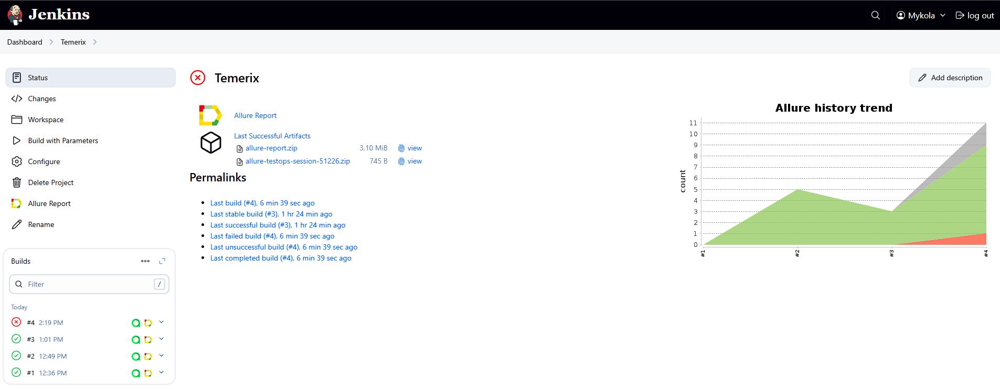
</p>

A parametrized Jenkins job can be launched with needed ***parameters***:
<p align="center">
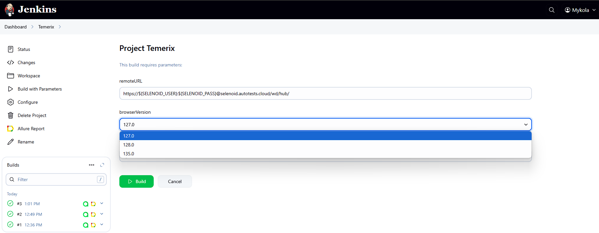
</p>

Sensitive config files are created in build workspace on build start.\
Relatively safe information transferred to the build by gradle arguments (see [Gradle command](#GradleCommand)
section, 'Additional parameters').

After the build is done the test results are available in:
>- <code><strong>*Allure Report*</strong></code>
>- <code><strong>*Allure TestOps*</strong></code> - results are uploaded there and the automated test-cases can be
   automatically updated accordingly to the recent changes in the code.


[Back to the table of contents ⬆](#TableOfContents)

<h1 align="center"> <a name="TelegramNotifications">Telegram Notifications</a></h1>

Telegram bot sends a brief report to a specified telegram chat by results of each build.
<p align="center">
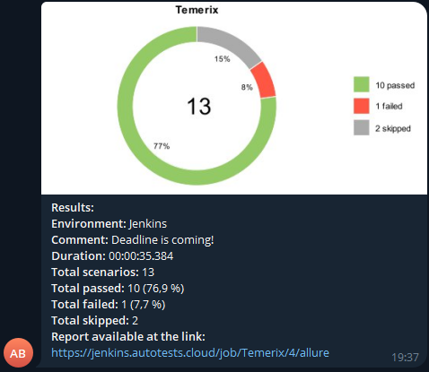
</p>

[Back to the table of contents ⬆](#TableOfContents)

# <h1 align="center"><a name="AllureReport">Test results report in [Allure Report](https://jenkins.autotests.cloud/job/Temerix/4/allure/)</a> </h1>

## Main page

Main page of Allure report contains the following blocks:

>- <code><strong>*ALLURE REPORT*</strong></code> - displays date and time of the test, overall number of launched
   tests, and a diagram with percent and number of passed, failed or broken tests
>- <code><strong>*TREND*</strong></code> - displays trend of running tests for all runs
>- <code><strong>*SUITES*</strong></code> - displays distribution of tests by suites
>- <code><strong>*CATEGORIES*</strong></code> - displays distribution of unsuccessful tests by defect types
<p align="center">
  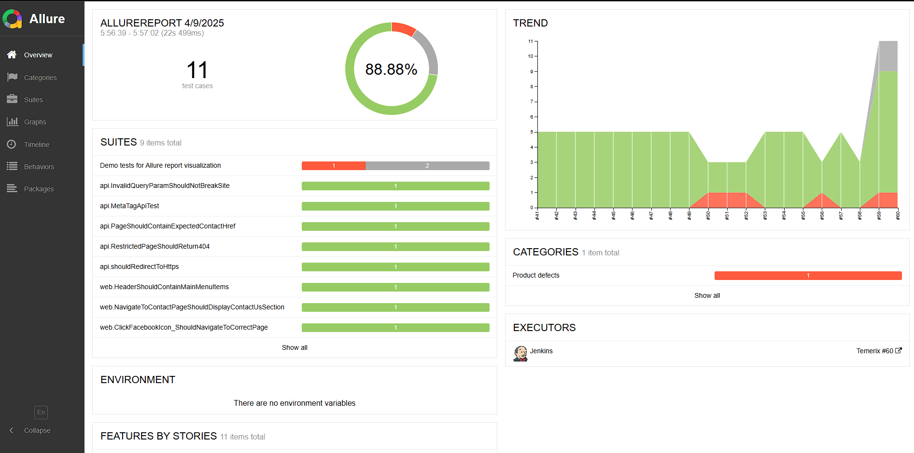
</p>

## List of tests with steps and test artefacts

On the page the list of the tests grouped by suites with status shown for each test.\
Full info about each test can be shown: tags, severity, duration, detailed steps.

Also additional test artifacts are available:
>- Screenshot
>- Page Source
>- Browser console log

<p align="left">
  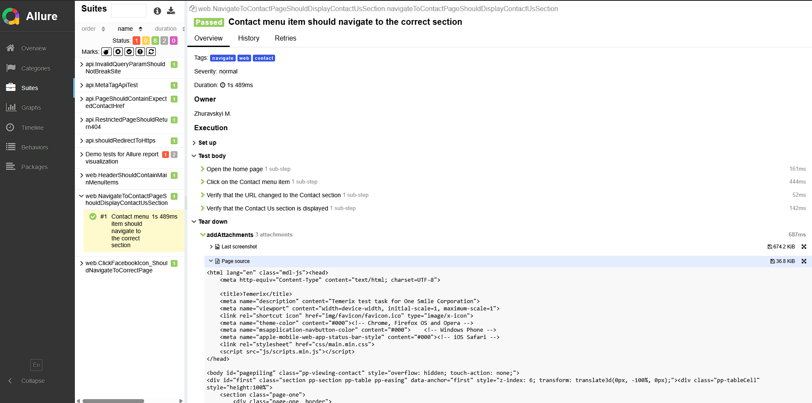
</p>

[Back to the table of contents ⬆](#TableOfContents)

# <h1 align="center"> <a name="AllureTestOps">[Allure TestOps]() integration</a></h1>

## <a name="AllureTestOpsProject">Project in Allure TestOps</a>

Test cases in this project are directly linked to the code and automatically kept up to date. There's no need for a separate manual synchronization process between automated and manual test cases.
Whenever an automated test is created or updated in the codebase, the corresponding test case in the test management system (TMS) is automatically updated as well.

If needed, manual test cases can also be added to the TMS — either through the web interface or directly in the code.


  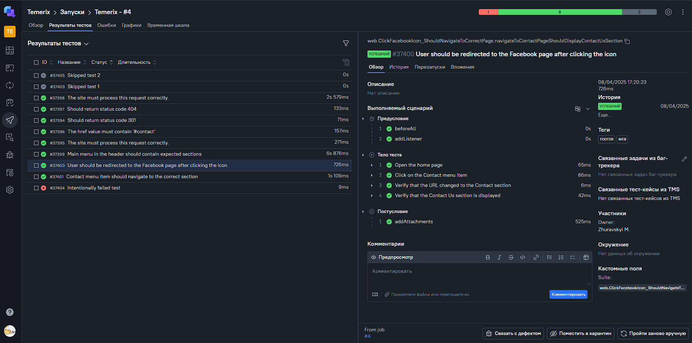</p>
  In <code><strong>Allure TestOps</strong></code> , there is a feature that allows real-time monitoring of test execution.

  As soon as the <code><strong>Jenkins</strong></code>job is done, corresponding tests get their statuses. A tester can finish manual tests (if any) and click "Close launch".

  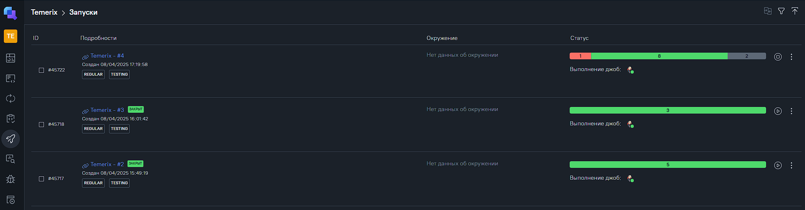</p>

After that all these test-cases(<code><strong>*names, steps, tags etc.*</strong></code>) will be updated according to the recent code changes.

[Back to the table of contents ⬆](#TableOfContents)

## <a name="Dashboard">Dashboard</a>

Automation trends charts, distribution tests by some different parameters etc.:

<p align="center">
  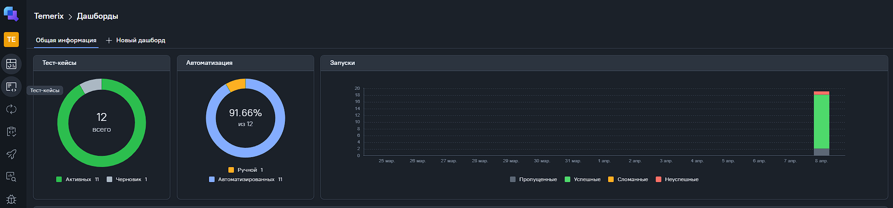
</p>

[Back to the table of contents ⬆](#TableOfContents)

## <a name="Bug">[BUG] Social media footer icons are not correctly displayed (Facebook/Twitter mismatch)</a>
Facebook link shows the Twitter icon

<p align="center">
  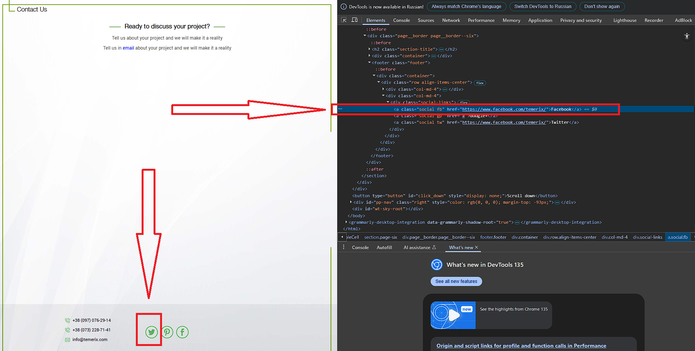
</p>

To ensure the issue is properly tracked and reproducible in manual testing, a dedicated manual test case has been created in **Allure TestOps**.

<p align="center">
  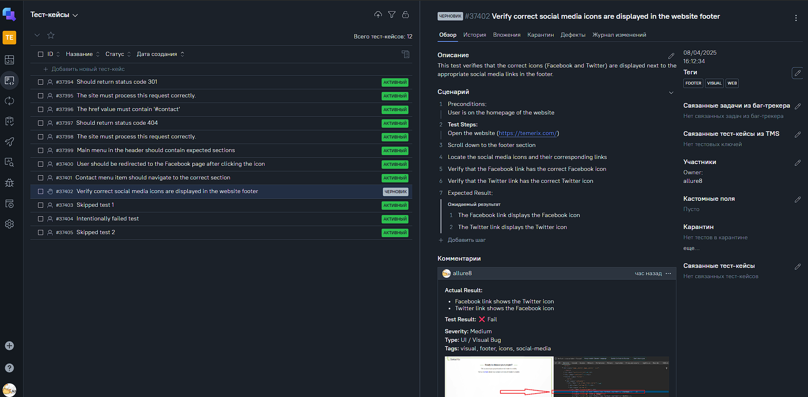
</p>

This test case describes the steps required to reproduce the issue with social media icons and has been linked to the bug report for further investigation and tracking.

[Back to the table of contents ⬆](#TableOfContents)

# <h1 align="center"> <a name="Jira">[Jira]() integration</a></h1>


In <code><strong>Jira</strong></code>, thanks to integration with <code><strong>Allure TestOps</strong></code>, all related test activities become visible directly within the issue view.
Test cases, launches, and their results are automatically linked to corresponding Jira tasks, making it easy to track testing progress and coverage.

This integration helps both testers and developers stay aligned on what has been tested, what failed, and what requires attention — all without leaving Jira.

<p align="center"> 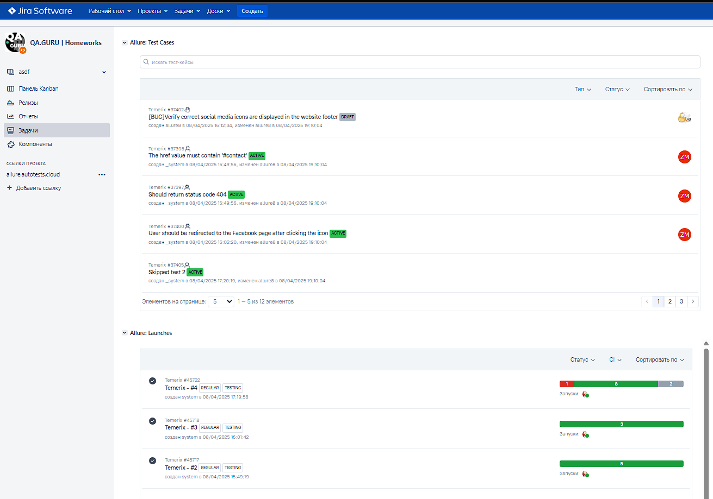 </p>

[Back to the table of contents ⬆](#TableOfContents)

# <h1 align="center"> <a name="Api">[Api ]() custom reporting</a></h1>

The <code><strong>API</strong></code> is integrated with Allure to provide detailed and visually appealing reports. Instead of the standard log format, the API offers color-coded, group-based data presentation, which makes it easier to understand test results at a glance.

This custom reporting feature breaks down test results into groups, highlighting success, failure, and skipped tests with different colors, allowing testers and developers to quickly identify trends and issues in their tests.

<p align="center"> 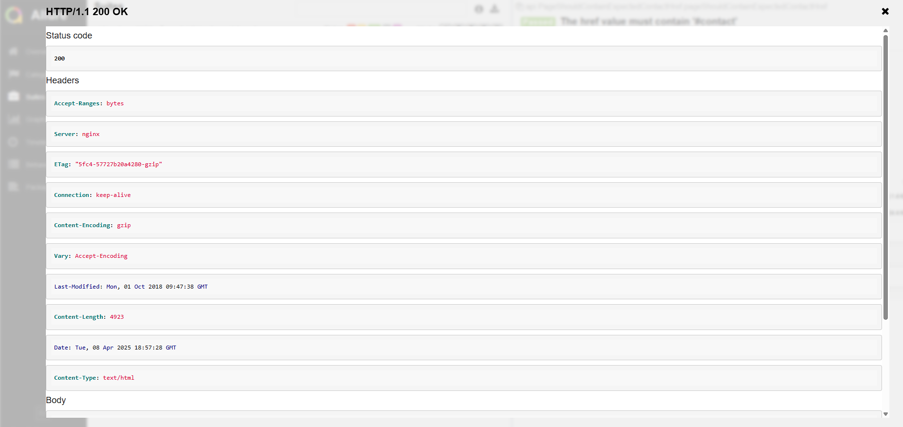 </p>

[Back to the table of contents ⬆](#TableOfContents)

# <h1 align="center"> <a name="Mobile">[Mobile]() test development</a></h1>

Mobile test development was carried out using a <code><strong>virtual Android device</strong></code> in <code><strong>Android Studio</strong></code> . The <code><strong>Appium</strong></code> server was launched to enable interaction with the emulator.

Through the <code><strong>Appium Inspector</strong></code>, I was able to inspect and validate locators, ensuring the correct identification and interaction with elements on the mobile app. This approach provided a seamless way to fine-tune and verify elements before running automated tests.

<p align="center"> 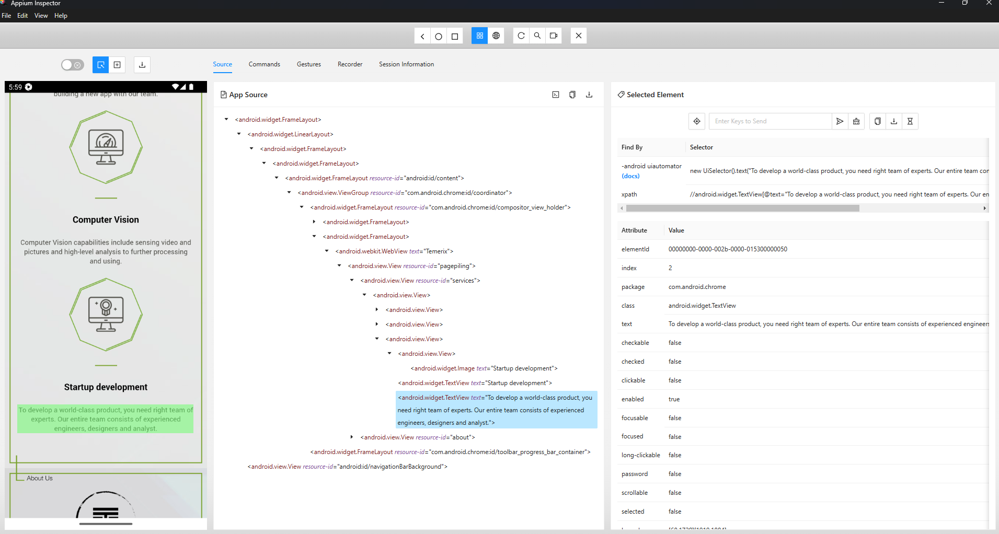 </p>

[Back to the table of contents ⬆](#TableOfContents)